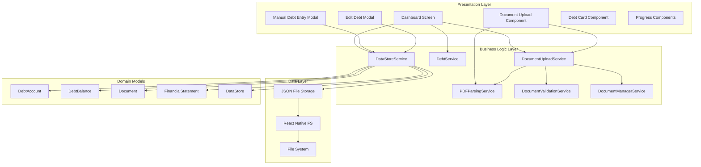
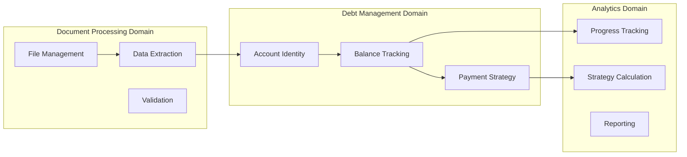
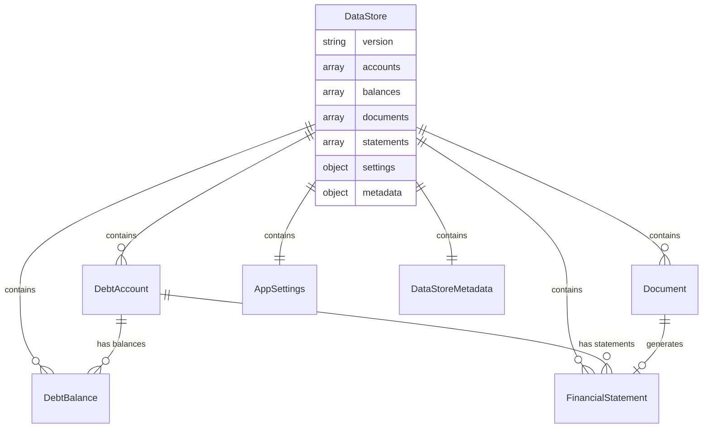
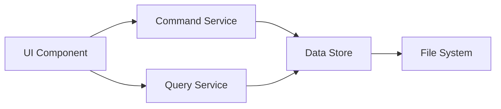
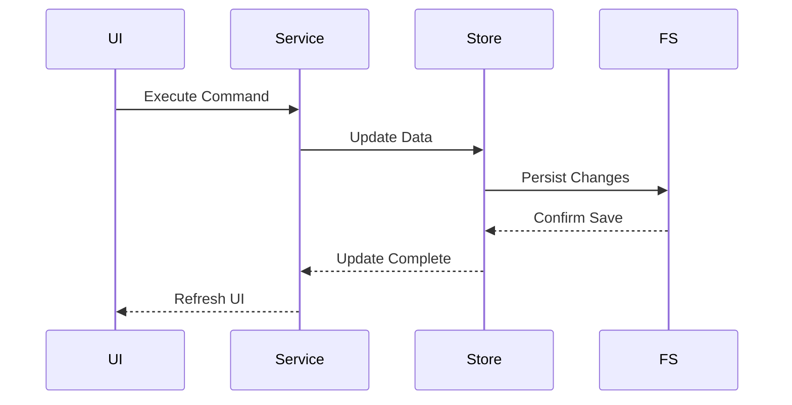
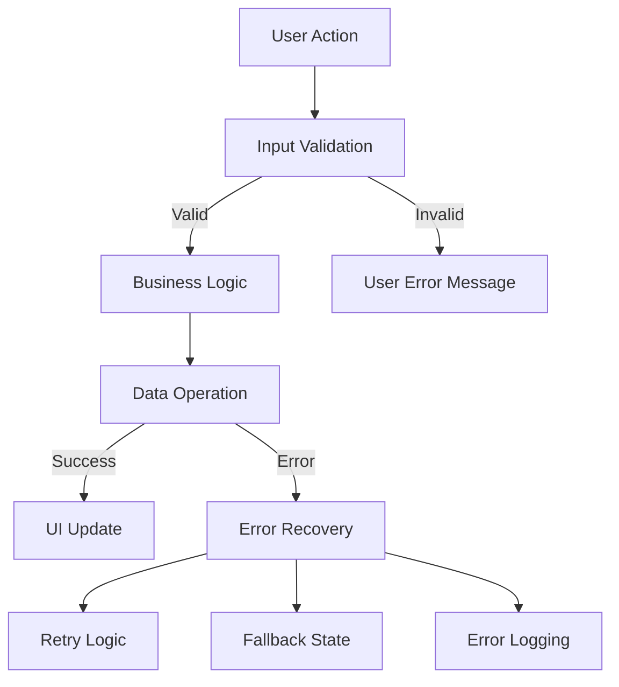
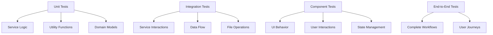
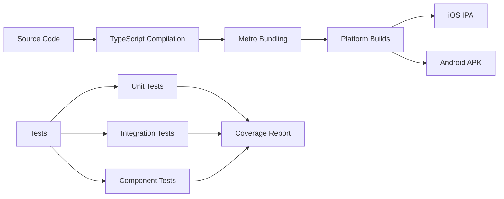

# Architecture Overview

This document provides a comprehensive overview of the DebtFreePro application architecture, including design patterns, data flow, and architectural decisions.

## System Architecture

### High-Level Architecture Diagram



## Architectural Patterns

### 1. Layered Architecture

The application follows a three-layer architecture pattern:

#### Presentation Layer
- **Components**: Reusable UI components
- **Screens**: Full-screen views (Dashboard, etc.)
- **Modals**: Overlay interactions (Add/Edit debt)

#### Business Logic Layer
- **Services**: Core business operations
- **Strategies**: Debt payoff algorithms
- **Validators**: Input validation logic

#### Data Layer
- **Storage**: File-based JSON persistence
- **Models**: TypeScript interfaces and types
- **Serialization**: Data transformation logic

### 2. Domain-Driven Design (DDD)

The application uses DDD principles with clear domain boundaries:



### 3. Service Layer Pattern

Services encapsulate business logic and provide a clean API:

```typescript
interface ServicePattern {
  // Clear responsibilities
  singleResponsibility: string;
  
  // Stateless operations
  pureOperations: boolean;
  
  // Error handling
  errorBoundaries: ErrorHandling;
  
  // Testability
  mockableInterface: boolean;
}
```

## Data Architecture

### Data Store Design



### Data Flow Patterns

#### 1. Command Query Responsibility Segregation (CQRS)



#### 2. Event-Driven Updates



## Component Architecture

### Component Hierarchy

```
App
├── Dashboard (Screen)
│   ├── Header
│   ├── ProgressSection
│   │   ├── ProgressBar
│   │   └── StatCard[]
│   ├── DocumentUpload
│   ├── DebtSection
│   │   └── DebtCard[]
│   └── NextStepsSection
├── ManualDebtEntryModal
└── EditDebtModal
```

### Component Communication Patterns

#### 1. Props Down, Events Up

```typescript
// Parent passes data down
<DebtCard 
  debt={debt} 
  isPriority={index === 0}
  onPress={handleDebtPress} 
/>

// Child emits events up
const DebtCard = ({ debt, onPress }) => {
  return (
    <TouchableOpacity onPress={() => onPress(debt)}>
      {/* UI content */}
    </TouchableOpacity>
  );
};
```

#### 2. Context for Shared State

```typescript
interface AppContextType {
  debts: Debt[];
  settings: AppSettings;
  refreshData: () => Promise<void>;
}

const AppContext = createContext<AppContextType>();
```

## Service Architecture

### Service Design Principles

#### 1. Single Responsibility
Each service has one clear purpose:
- `DataStoreService`: Data persistence and retrieval
- `DebtService`: Debt calculation algorithms
- `DocumentUploadService`: File upload and processing
- `PDFParsingService`: PDF content extraction

#### 2. Interface Segregation
Services provide focused interfaces:

```typescript
interface DataPersistence {
  save(data: any): Promise<void>;
  load(): Promise<any>;
}

interface DebtCalculations {
  calculateSnowball(debts: Debt[]): Strategy;
  findOpportunities(debts: Debt[]): Opportunity[];
}

interface DocumentProcessing {
  upload(file: File): Promise<Document>;
  parse(document: Document): Promise<Statement>;
}
```

#### 3. Dependency Injection
Services can be easily mocked for testing:

```typescript
class DataStoreService {
  constructor(
    private fileSystem: FileSystemInterface = RNFS,
    private serializer: SerializerInterface = JSONSerializer
  ) {}
}
```

## Error Handling Architecture

### Error Boundaries



### Error Types and Handling

#### 1. User Input Errors
```typescript
interface ValidationError {
  field: string;
  message: string;
  code: ValidationErrorCode;
}

const handleValidationError = (error: ValidationError) => {
  // Show inline error message
  setFieldError(error.field, error.message);
};
```

#### 2. System Errors
```typescript
interface SystemError {
  type: 'FileSystem' | 'Network' | 'Parse' | 'Unknown';
  message: string;
  recoverable: boolean;
}

const handleSystemError = (error: SystemError) => {
  if (error.recoverable) {
    // Show retry option
    showRetryDialog(error.message);
  } else {
    // Show fallback state
    showErrorState(error.message);
  }
};
```

## Performance Architecture

### Optimization Strategies

#### 1. Lazy Loading
```typescript
const Dashboard = () => {
  const [debts, setDebts] = useState<Debt[]>([]);
  
  useEffect(() => {
    // Load data only when component mounts
    loadDebtData().then(setDebts);
  }, []);
};
```

#### 2. Memoization
```typescript
const DebtCard = memo(({ debt, onPress }) => {
  return (
    <TouchableOpacity onPress={() => onPress(debt)}>
      {/* Expensive rendering */}
    </TouchableOpacity>
  );
});
```

#### 3. Batch Operations
```typescript
const batchUpdateDebts = async (updates: DebtUpdate[]) => {
  const dataStore = await DataStoreService.loadData();
  
  // Apply all updates in memory
  updates.forEach(update => applyUpdate(dataStore, update));
  
  // Single save operation
  await DataStoreService.saveData(dataStore);
};
```

## Security Architecture

### Data Protection

#### 1. Input Sanitization
```typescript
const sanitizeInput = (input: string): string => {
  return input
    .trim()
    .replace(/[<>]/g, '') // Remove potential script tags
    .substring(0, 255);   // Limit length
};
```

#### 2. File Validation
```typescript
const validateUpload = (file: File): ValidationResult => {
  const allowedTypes = ['application/pdf', 'text/csv'];
  const maxSize = 10 * 1024 * 1024; // 10MB
  
  if (!allowedTypes.includes(file.type)) {
    return { valid: false, error: 'Invalid file type' };
  }
  
  if (file.size > maxSize) {
    return { valid: false, error: 'File too large' };
  }
  
  return { valid: true };
};
```

#### 3. Data Encryption (Future)
```typescript
interface EncryptionService {
  encrypt(data: string): Promise<string>;
  decrypt(encryptedData: string): Promise<string>;
}

// Could be implemented for sensitive financial data
const secureDataStore = new EncryptedDataStore(
  new AESEncryptionService(userKey)
);
```

## Testing Architecture

### Testing Strategy



### Test Patterns

#### 1. Service Testing
```typescript
describe('DataStoreService', () => {
  beforeEach(() => {
    // Mock file system
    mockRNFS.exists.mockResolvedValue(true);
    mockRNFS.readFile.mockResolvedValue(mockData);
  });
  
  it('should create new debt account', async () => {
    const account = await DataStoreService.createAccount(params);
    expect(account.id).toBeDefined();
    expect(account.name).toBe(params.name);
  });
});
```

#### 2. Component Testing
```typescript
describe('DebtCard', () => {
  it('should call onPress when tapped', () => {
    const onPressMock = jest.fn();
    const { getByTestId } = render(
      <DebtCard debt={mockDebt} onPress={onPressMock} />
    );
    
    fireEvent.press(getByTestId('debt-card'));
    expect(onPressMock).toHaveBeenCalledWith(mockDebt);
  });
});
```

## Deployment Architecture

### Build Pipeline



### Environment Configuration

```typescript
interface Environment {
  name: 'development' | 'staging' | 'production';
  apiUrl?: string;
  logLevel: 'debug' | 'info' | 'warn' | 'error';
  enableAnalytics: boolean;
}

const config: Environment = {
  name: process.env.NODE_ENV as any,
  logLevel: __DEV__ ? 'debug' : 'warn',
  enableAnalytics: !__DEV__
};
```

## Future Architecture Considerations

### Scalability Improvements

1. **State Management**: Consider Redux/Zustand for complex state
2. **Offline Support**: Implement proper offline-first architecture
3. **Synchronization**: Add cloud sync capabilities
4. **Real-time Updates**: WebSocket integration for live data
5. **Microservices**: Split services into smaller, focused modules

### Technology Evolution

1. **Database Migration**: Move from JSON to SQLite/Realm
2. **API Integration**: Connect to financial institution APIs
3. **AI/ML Features**: Intelligent spending analysis
4. **Progressive Web App**: Cross-platform web support
5. **GraphQL**: More efficient data fetching

This architecture provides a solid foundation for the current application while remaining flexible enough to accommodate future growth and feature additions.