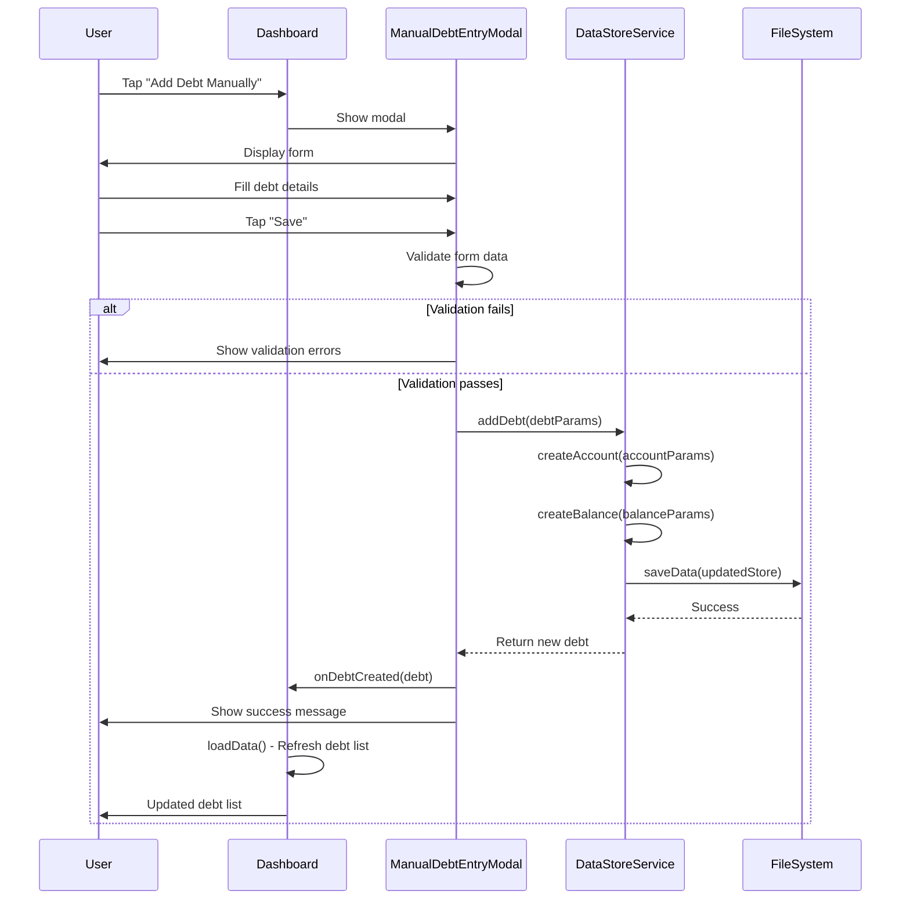
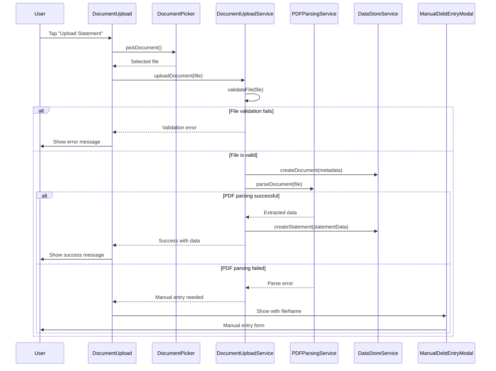
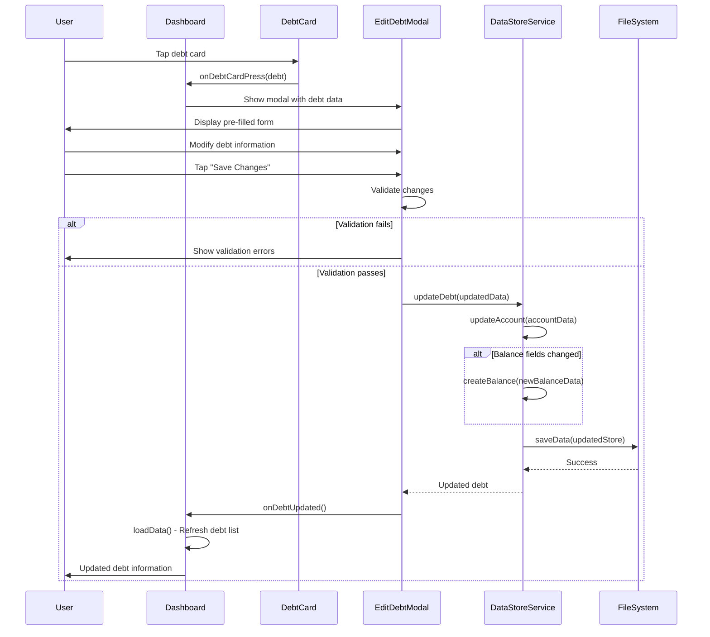
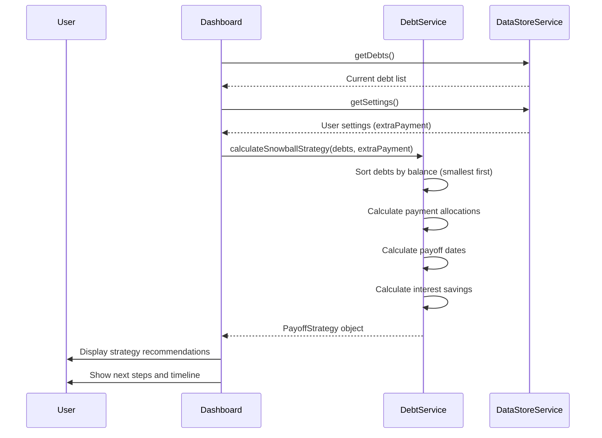
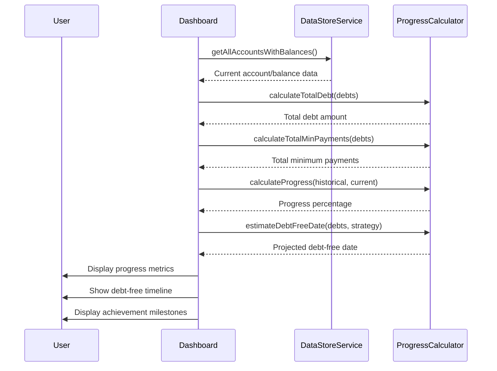
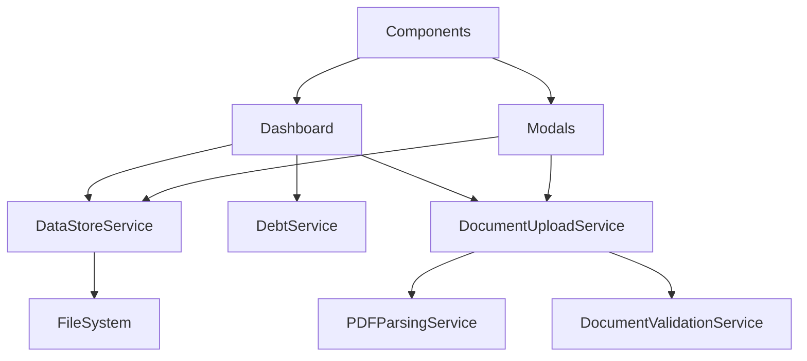

# Dashboard Actions and Workflows

This document describes the key actions available from the dashboard and their detailed workflows using sequence diagrams.

## Overview

The DebtFreePro dashboard serves as the central hub for all debt management activities. Users can perform the following primary actions:

1. **Manual Debt Entry** - Add new debts manually
2. **Document Upload** - Upload financial statements for processing
3. **Debt Editing** - Modify existing debt information
4. **Strategy Calculation** - Calculate and view payoff strategies
5. **Progress Tracking** - Monitor overall debt reduction progress

## Action Workflows

### 1. Manual Debt Entry

This workflow allows users to manually add new debt accounts to their portfolio.

**Key Steps:**
1. User initiates debt creation from dashboard
2. Modal validates input data
3. Service creates account and initial balance records
4. Data is persisted to file system
5. Dashboard refreshes to show new debt

### 2. Document Upload and Processing

This workflow handles uploading financial statements and extracting debt information.

**Key Steps:**
1. User selects document via file picker
2. Service validates file type and size
3. Document metadata is saved
4. PDF parsing attempts to extract data
5. If successful, statement is created automatically
6. If parsing fails, manual entry modal is shown

### 3. Debt Editing

This workflow allows users to modify existing debt information.

**Key Steps:**
1. User selects debt from dashboard
2. Edit modal pre-populates with current data
3. Service updates account information
4. If balance changed, new balance record is created
5. Changes are persisted and dashboard refreshes

### 4. Strategy Calculation

This workflow calculates and displays debt payoff strategies.

**Key Steps:**
1. Dashboard loads current debt data and settings
2. DebtService applies snowball algorithm
3. Debts are sorted by balance (smallest first)
4. Payment allocations and timelines are calculated
5. Strategy is displayed with actionable next steps

### 5. Progress Tracking

This workflow displays overall debt reduction progress and statistics.

**Key Steps:**
1. Dashboard loads current financial data
2. Calculator services compute various metrics
3. Progress percentage is calculated from historical data
4. Debt-free date is projected based on current strategy
5. Visual progress indicators are updated

## Data Flow Summary

### Common Patterns

1. **Validation**: All user inputs are validated before processing
2. **Atomic Operations**: Data changes are saved atomically
3. **Error Handling**: Failed operations show meaningful error messages
4. **Refresh**: UI automatically refreshes after data changes
5. **Persistence**: All changes are immediately saved to file system

### Service Interactions

## Error Handling Strategies

### User-Facing Errors
- **Validation Errors**: Inline form validation with helpful messages
- **Network Errors**: Retry mechanisms with user notification
- **File Errors**: Clear guidance on supported formats and sizes
- **Processing Errors**: Fallback to manual entry when automated processing fails

### System Errors
- **Storage Errors**: Graceful degradation with local caching
- **Parse Errors**: Detailed logging for debugging
- **State Errors**: Automatic state recovery mechanisms

## Performance Considerations

1. **Lazy Loading**: Dashboard loads data on-demand
2. **Caching**: Frequently accessed data is cached in memory
3. **Batch Operations**: Multiple changes are batched for efficiency
4. **Background Processing**: File processing happens asynchronously
5. **Optimistic Updates**: UI updates immediately with rollback on failure

## Security Considerations

1. **Input Validation**: All user inputs are sanitized
2. **File Validation**: Uploaded files are validated for type and content
3. **Data Encryption**: Sensitive financial data could be encrypted at rest
4. **Access Control**: File system access is properly restricted
5. **Error Information**: Error messages don't expose sensitive system details