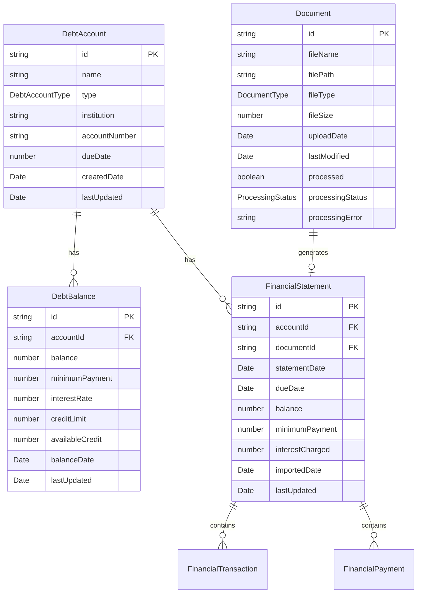

# Domain Models

This document describes the domain models used in DebtFreePro and their relationships.

## Overview

The domain models are designed using Domain-Driven Design (DDD) principles, with clear separation of concerns and well-defined boundaries between different aspects of debt management.

## Core Domain Models

### 1. DebtAccount

Represents the identity and metadata of a debt account.

```typescript
interface DebtAccount {
  id: string;                    // Unique identifier
  name: string;                  // User-friendly name
  type: DebtAccountType;         // Type of debt
  institution: string;           // Financial institution
  accountNumber?: string;        // Account number (last 4 digits)
  dueDate?: number;             // Day of month payment is due
  createdDate: Date;            // When account was created
  lastUpdated: Date;            // Last modification timestamp
}
```

**Account Types:**
- `CREDIT_CARD`
- `LINE_OF_CREDIT`
- `AUTO_LOAN`
- `PERSONAL_LOAN`
- `STUDENT_LOAN`
- `MORTGAGE`
- `OTHER`

### 2. DebtBalance

Represents the financial balance information for an account at a specific point in time.

```typescript
interface DebtBalance {
  id: string;                    // Unique identifier
  accountId: string;             // Reference to DebtAccount
  balance: number;               // Current balance
  minimumPayment: number;        // Minimum payment required
  interestRate: number;          // Annual interest rate (%)
  creditLimit?: number;          // Credit limit (for credit cards)
  availableCredit?: number;      // Available credit
  balanceDate: Date;            // Date of this balance snapshot
  lastUpdated: Date;            // Last modification timestamp
}
```

### 3. Document

Represents uploaded documents and their processing status.

```typescript
interface Document {
  id: string;                    // Unique identifier
  fileName: string;              // Original file name
  filePath: string;             // Path to stored file
  fileType: DocumentType;        // Type of document
  fileSize: number;             // File size in bytes
  uploadDate: Date;             // When file was uploaded
  lastModified: Date;           // File modification date
  processed: boolean;           // Whether processing is complete
  processingStatus: ProcessingStatus; // Current processing status
  processingError?: string;     // Error message if processing failed
}
```

**Document Types:**
- `PDF_STATEMENT`
- `CSV_EXPORT`
- `EXCEL_EXPORT`
- `IMAGE_STATEMENT`

**Processing Status:**
- `PENDING`
- `PROCESSING`
- `COMPLETED`
- `FAILED`

### 4. FinancialStatement

Represents a financial statement with transactions and payments.

```typescript
interface FinancialStatement {
  id: string;                    // Unique identifier
  accountId: string;             // Reference to DebtAccount
  documentId?: string;           // Reference to source Document
  statementDate: Date;          // Statement date
  dueDate: Date;                // Payment due date
  balance: number;              // Statement balance
  minimumPayment: number;       // Minimum payment due
  interestCharged: number;      // Interest charged this period
  creditLimit?: number;         // Credit limit
  availableCredit?: number;     // Available credit
  interestRate?: number;        // Interest rate
  transactions: FinancialTransaction[]; // All transactions
  payments: FinancialPayment[]; // All payments
  importedDate: Date;           // When statement was imported
  lastUpdated: Date;           // Last modification timestamp
}
```

### 5. Supporting Types

#### FinancialTransaction
```typescript
interface FinancialTransaction {
  id: string;
  date: Date;
  amount: number;
  description: string;
  category?: string;
  type: TransactionType; // 'purchase' | 'fee' | 'interest' | 'adjustment'
}
```

#### FinancialPayment
```typescript
interface FinancialPayment {
  id: string;
  date: Date;
  amount: number;
  description: string;
  type: PaymentType; // 'payment' | 'credit' | 'refund'
}
```

## Domain Relationships



## Data Store Schema

The unified data store brings all domain models together:

```typescript
interface DataStoreV2 {
  version: string;               // Schema version
  accounts: DebtAccount[];       // All debt accounts
  balances: DebtBalance[];       // All balance records
  documents: Document[];         // All uploaded documents
  statements: FinancialStatement[]; // All financial statements
  settings: AppSettings;         // Application settings
  metadata: DataStoreMetadata;   // Store metadata
}
```

## Design Principles

### 1. Separation of Concerns
- **Account Identity** is separate from **Balance Information**
- **Document Metadata** is separate from **Financial Data**
- **Statements** are separate from **Accounts** but linked by reference

### 2. Historical Tracking
- Balance changes are tracked over time (new balance records)
- Statements maintain complete transaction history
- All entities have timestamp tracking

### 3. Referential Integrity
- Foreign key relationships via string IDs
- Cascading deletes (deleting account removes related data)
- Optional relationships where appropriate

### 4. Extensibility
- Enum types allow for new categories
- Optional fields support evolution
- Versioned schema supports migrations

## Benefits of This Design

1. **Flexibility**: Accounts and balances can evolve independently
2. **History**: Complete audit trail of balance changes
3. **Performance**: Efficient queries for current vs historical data
4. **Maintainability**: Clear boundaries between concepts
5. **Testability**: Each domain model can be tested in isolation

## Migration from Legacy Model

The previous monolithic `Debt` model has been decomposed into:

- `DebtAccount` + `DebtBalance` (replacing `Debt`)
- `FinancialStatement` (replacing `Statement` with enhanced structure)
- `Document` (new entity for file management)

Legacy compatibility is maintained through adapter methods in `DataStoreService`.